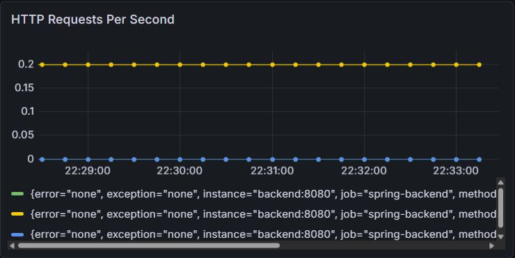
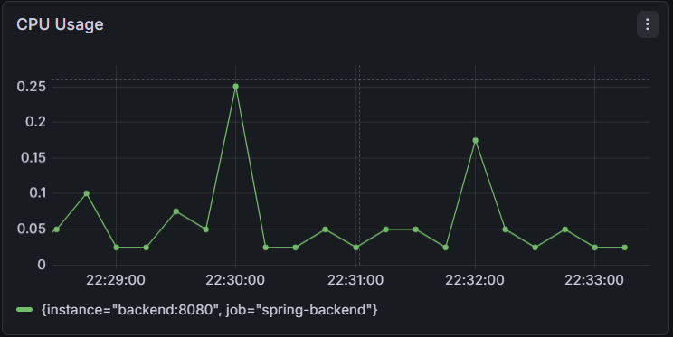
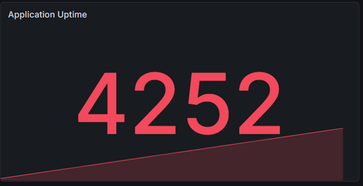
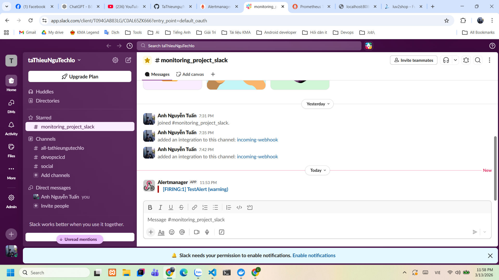

# Monitoring System with Prometheus, Grafana & Alertmanager

## 📌 Project Overview

This project demonstrates how to monitor a Spring Boot application using a complete monitoring stack.

The system collects application metrics, visualizes them in dashboards, and automatically sends alerts when abnormal conditions are detected.

Monitoring tools used in this project:

* Prometheus for metrics collection
* Grafana for visualization
* Alertmanager for alert management
* Slack for alert notifications

---

## 🧰 Tech Stack

* Spring Boot
* Prometheus
* Grafana
* Alertmanager
* Docker & Docker Compose
* Micrometer
* Slack Webhook

---

## 🏗 Architecture

User
  │
  ▼
Spring Boot App
  │
  ▼
Micrometer Metrics
  │
  ▼
Prometheus
  │
  ├── Grafana (Dashboards)
  │
  └── Alertmanager
           │
           ▼
         Slack

Prometheus scrapes metrics from the Spring Boot application using the endpoint:

/actuator/prometheus

---

## 📊 Dashboards

The monitoring dashboards are created in Grafana.

Two main dashboard groups are included in this project.

### System Monitoring

System level metrics:

* CPU Usage
* JVM Memory Usage
* Thread Usage

### Application Monitoring

Application level metrics:

* HTTP Requests Per Second
* Request Latency
* Application Uptime

Example dashboard:


Example panels:









---

## 🚨 Alerting System

Alerts are configured using Prometheus Alert Rules and managed by Alertmanager.

Example alert conditions:

* High CPU usage
* High request rate
* Application downtime

Alert flow:

Prometheus Alert Rule
⬇
Alertmanager
⬇
Slack Webhook
⬇
Slack Channel Notification

---

## ⚙️ Setup & Run

### 1. Clone the repository

```bash
git clone https://github.com/TaThieungu/Monitoring_project.git
cd Monitoring_project
```

### 2. Start services

```bash
docker compose up -d
```

### 3. Access services

Prometheus

http://localhost:9090

Grafana

http://localhost:3000

Default Grafana login:

username: admin
password: admin123

Alertmanager

http://localhost:9093

---

## 📁 Project Structure

```
Monitoring_project
|
├── 01-starter-files_db-scripts
├── 02-backend_spring-boot-rest-api
├── 03-frontend_angular-ecommerce
|
├── monitoring
│   ├── prometheus
│   │   ├── prometheus.yml
│   │   └── alert_rules.yml
│   │
│   ├── alerts
│   │   |── alertmanager.yml
│   │   |── alert_rules.yml
│   │   |── alertmanager.yml.example
│   │   └── Test_notification.png
│   │
│   └── grafana
│       ├── dashboards
│       │   └── system-app-dashboard.json
│       │
│       └── panel
│           ├── App_uptime.png
│           ├── CPU_usage.png
│           └── HTTP_Request_per_second.png
|
├── docker-compose.yml
└── README.md
```

---

## 📈 Metrics Collected

Application Metrics

* HTTP request rate
* HTTP request latency
* Application uptime

System Metrics

* CPU usage
* JVM memory usage
* Thread usage

---

## 🚀 Future Improvements

Possible improvements for this monitoring system:

* Add Loki for log monitoring
* Add Promtail for log shipping
* Add Node Exporter for host monitoring
* Deploy the monitoring stack on Kubernetes
* Add more Grafana dashboards

---

## 👨‍💻 Author

TaThieuNgu

DevOps Monitoring Practice Project
