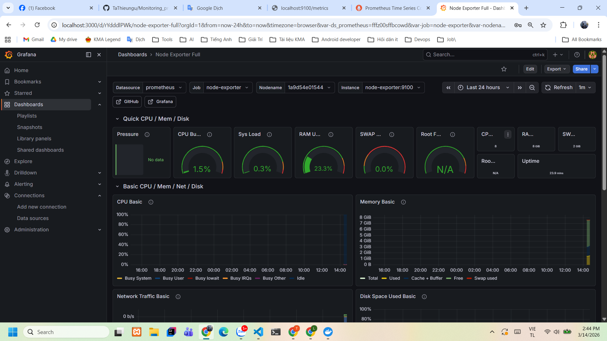

# Monitoring & Observability System with Prometheus, Grafana, Loki and Alertmanager

## 📌 Project Overview

This project demonstrates how to build a **complete monitoring and observability stack** for a Spring Boot application.

The system collects **application metrics, infrastructure metrics, and logs**, visualizes them using dashboards, and sends **automatic alerts to Slack** when abnormal conditions are detected.

This repository simulates a **real-world DevOps monitoring environment** using containerized services.

Main capabilities of the system:

• Collect **application metrics** from Spring Boot
• Collect **infrastructure metrics** from the host system
• Collect and analyze **application logs**
• Visualize metrics and logs with dashboards
• Trigger alerts when thresholds are exceeded
• Send alert notifications to Slack

---

# 🧰 Tech Stack

### Application

* Spring Boot
* Angular
* MySQL

### Monitoring & Observability

* Prometheus (Metrics collection)
* Grafana (Visualization)
* Alertmanager (Alert routing)
* Node Exporter (Infrastructure metrics)
* Loki (Log aggregation)
* Promtail (Log collection)

### Infrastructure

* Docker
* Docker Compose
* Micrometer

### Notifications

* Slack Webhook

---

# 🏗 System Architecture

```
User
 │
 ▼
Frontend (Angular)
 │
 ▼
Backend (Spring Boot)
 │
 ▼
Micrometer Metrics
 │
 ▼
Prometheus
 │
 ├── Grafana (Metrics Dashboards)
 │
 └── Alertmanager
        │
        ▼
      Slack Alerts


Application Logs
 │
 ▼
Promtail
 │
 ▼
Loki
 │
 ▼
Grafana (Logs Dashboard)


Host Infrastructure
 │
 ▼
Node Exporter
 │
 ▼
Prometheus
```

Prometheus collects application metrics from the Spring Boot application using the endpoint:

```
/actuator/prometheus
```

---

# 📊 Monitoring Dashboards

Dashboards are created and visualized using Grafana.

The project includes dashboards for **application monitoring, system monitoring, and log analysis**.

---

## Application Monitoring

Application level metrics include:

• HTTP Requests per second
• Request latency
• Application uptime
• Error rate

Example panel:


---

## System Monitoring (Node Exporter)

Infrastructure metrics are collected using Node Exporter.

Metrics include:

• CPU usage
• Memory usage
• System load
• Disk I/O

Example panel:




---

## Log Monitoring (Loki)

Application logs are collected using **Promtail** and stored in **Loki**.

Grafana dashboards allow filtering and searching logs.

Example log dashboard:


---

# 🚨 Alerting System

Alerts are defined using **Prometheus alert rules** and managed by Alertmanager.

Example alert conditions:

• High CPU usage
• High request rate
• Application downtime
• High error log rate

Alert pipeline:

```
Prometheus Alert Rule
        │
        ▼
Alertmanager
        │
        ▼
Slack Webhook
        │
        ▼
Slack Channel Notification
```

Example alert notification:


---

# 📁 Project Structure

```
Monitoring_project
│
├── 01-starter-files_db-scripts
├── 02-backend_spring-boot-rest-api
├── 03-frontend-angular-ecommerce
│
├── monitoring
│
│   ├── alerts
│   │   ├── alert_rules.yml
│   │   ├── alertmanager.yml
│   │   ├── alertmanager.yml.example
│   │   ├── Test_notification.png
│   │   └── Test_error_log.png
│
│   ├── grafana
│   │   ├── dashboard
│   │   │   ├── app_dashboard.json
│   │   │   ├── error_logs_dashboard.json
│   │   │   └── node_exporter_ifra_dashboard.json
│   │   │
│   │   └── panel
│   │       ├── App_uptime.png
│   │       ├── CPU_usage.png
│   │       ├── Error_logs.png
│   │       ├── HTTP_Request_per_second.png
│   │       └── Example_node_exporter.png
│
│   ├── loki
│   │   ├── loki-config.yml
│   │   └── promtail-config.yml
│
│   └── prometheus
│       └── prometheus.yml
│
├── docker-compose.yml
├── .env
└── README.md
```

---

# 📈 Metrics Collected

## Application Metrics

Collected using Micrometer.

Examples:

• HTTP request rate
• Request latency
• Application uptime
• JVM memory usage
• Thread usage

---

## Infrastructure Metrics

Collected using Node Exporter.

Examples:

• CPU usage
• Memory usage
• Disk usage
• System load

---

## Log Data

Collected using Promtail and stored in Loki.

Examples:

• Application logs
• Error logs
• Container logs

---

# ⚙️ Setup & Run

## 1 Clone the repository

```bash
git clone https://github.com/TaThieungu/Monitoring_project.git
cd Monitoring_project
```

---

## 2 Start the monitoring stack

```bash
docker compose up -d
```

---

## 3 Access the services

Prometheus

```
http://localhost:9090
```

Grafana

```
http://localhost:3000
```

Default login:

```
username: admin
password: admin123
```

Alertmanager

```
http://localhost:9093
```

---

# 🧪 Testing Alerts

Alerts can be triggered by:

• generating high CPU load
• sending many HTTP requests
• producing application error logs

Example test for log alert:

```
docker logs backend-springboot
```

Promtail will forward logs to Loki and alerts will be triggered if error thresholds are exceeded.

---

# 🔒 Security Notes

Sensitive configuration such as Slack Webhook URLs are **not stored in the repository**.

Use environment variables via `.env` file.

Example:

```
SLACK_WEBHOOK_URL=your_webhook_url
```

---

# 🚀 Future Improvements

Possible improvements for this monitoring system:

• Add Kubernetes deployment
• Add distributed tracing (Jaeger / Tempo)
• Add log parsing and structured logging
• Add advanced Grafana dashboards
• Implement CI/CD monitoring integration

---

# 👨‍💻 Author

TaThieuNgu

DevOps Monitoring Practice Project
